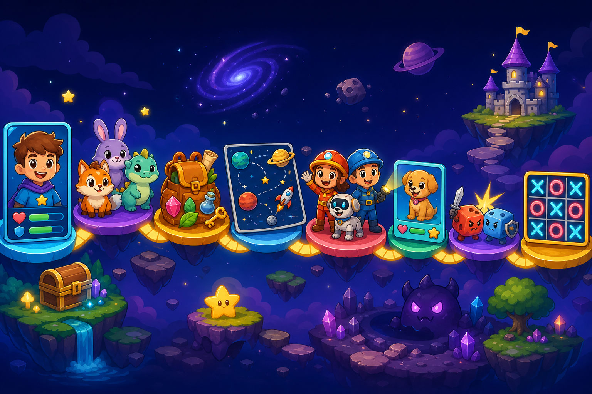

# Python for Kids — Terminal to Pygame Creator Path

หลักสูตร Python แบบลงมือพิมพ์และสร้างเกมสำหรับเด็กประถม



เด็กจะเริ่มจาก Python บน Terminal เพื่อเข้าใจ `print()`, `input()` และ Logic
จากนั้นในแต่ละ Chapter จะเรียน Pygame เพิ่มเพียงหนึ่งเรื่อง แล้วนำความรู้ใหม่
ไปแปลง Mini Project เดิมให้มีหน้าต่าง ภาพ ปุ่ม และการโต้ตอบ

## ติดตั้ง Pygame

macOS / Linux:

```bash
python3 -m pip install pygame
```

Windows (PowerShell หรือ Command Prompt):

```powershell
py -m pip install pygame
```

ตรวจว่าติดตั้งสำเร็จ:

```powershell
py -c "import pygame; print(pygame.version.ver)"
```

> สำหรับครู: ให้ทดลอง Run ไฟล์ Pygame ทุกไฟล์บนเครื่องที่จะใช้สอนก่อนเริ่มคาบ
> ไฟล์ตัวอย่างมีคอมเมนต์แบ่ง `SETUP`, `EVENT`, `UPDATE` และ `DRAW` ไว้แล้ว
> หาก Windows ไม่มีคำสั่ง `py` ให้ลอง `python` และตรวจว่าเลือก Add Python to PATH
> ตอนติดตั้ง Python แล้ว
>
> หากใช้ Python รุ่นใหม่มากและติดตั้ง `pygame` ไม่ผ่าน ให้ใช้
> `py -m pip install pygame-ce` (Windows) หรือ
> `python3 -m pip install pygame-ce` (macOS/Linux) แทน โค้ดยังคงเขียน
> `import pygame` เหมือนเดิม

ในแต่ละ Chapter ใช้รูปแบบเดียวกัน:

1. ครูอธิบาย Example
2. เด็กอ่านโจทย์ Practice แล้วคิดและพิมพ์โค้ดด้วยตัวเอง
3. เด็กทำ Your Turn หรือ TODO
4. ตรวจคำตอบในโฟลเดอร์ `answers`
5. ปิดท้ายด้วยเกม Terminal เพื่อยืนยันความเข้าใจ Python
6. เรียน Pygame Basic หนึ่งเรื่อง
7. แปลงเกมเดิมเป็น Pygame และทำ Creative Challenge

### วิธีสอน Pygame ให้เด็กรู้ว่ากำลังทำอะไร

ทุกไฟล์สอนใช้จังหวะเดียวกัน: **เป้าหมาย → พิมพ์ → ทายผล → Run → อธิบาย**
ครูให้เด็กชี้ 4 ส่วนก่อนจบ Practice: **DATA** ที่เกมจำ, **EVENT** ที่ผู้เล่นทำ,
**UPDATE/logic** ที่เปลี่ยนข้อมูล และ **DRAW** ที่นำข้อมูลไปแสดง ไม่เน้นจำคำสั่งโดด ๆ

Chapter 01–03 ใช้ `pygame.event.wait()` เพื่อยังไม่ข้ามไปใช้ Loop; Chapter 04
จึงสอน Game Loop แบบ `EVENT → UPDATE → DRAW` แล้วใช้ pattern นี้ต่อจนจบหลักสูตร

ไฟล์ Upgrade ต้องเปิดคู่กับ Terminal Project ของเด็กและใช้ Migration Map:
เก็บ DATA/logic เดิม, เปลี่ยน `input → event`, เปลี่ยน `print → render/draw`
จึงไม่ต้องเขียนเกมซ้ำจากศูนย์

## Pygame Progression

| Chapter | เกมที่นำมา Upgrade | Pygame เรื่องใหม่ |
|---|---|---|
| 01 Basic | Profile Generator | เปิดหน้าต่าง สี รูปทรง เส้น และข้อความ |
| 02 If–Else | Mystery Animal | Event, รูปภาพ และปุ่มคลิก |
| 03 Lists | Treasure Backpack | วาด Inventory จาก List |
| 04 Loops | Mystery Animal Loop | Game loop, FPS, keyboard และ animation |
| 05 Tuples | Space Coordinates | ตำแหน่ง `(x, y)` และการคลิกวัตถุ |
| 06 Sets | Rescue Team | เลือกตัวละครโดยไม่ซ้ำ |
| 07 Dictionaries | Pet Rescue | สร้าง Character Card จาก Dictionary |
| 08 Functions | Dice Battle | แยก UI และ game logic เป็น Functions |

Chapter 01–02 เก็บ Terminal Version ไว้ครบ แล้วเพิ่ม Pygame Version ต่อท้าย
เพื่อให้ครูเปรียบเทียบ `print/input` กับ `render/event` ได้โดยตรง ส่วนภาพใน
`assets/` เป็นตัวเลือกพร้อมใช้ เด็กสามารถเปลี่ยนเป็นภาพของตัวเองหลังเกมทำงานแล้ว

ตั้งแต่ Chapter 04 มี `assets/game_asset_choices.png` เป็นภาพ atlas ชุด Space,
Heroes, Pets, Dice Monster, Heart และ Star พร้อม README บอกวิธีเลือกใช้ เด็กไม่ต้อง
เสียเวลาค้นภาพในคาบ แต่ยังเลือกวาดหรือเปลี่ยนภาพเองได้ใน Creative Challenge

## 10 Classes

| ลำดับ | Chapter | เนื้อหาหลัก |
|---:|---|---|
| 01 | [Basic](./01_basic) | Comments, Print, Variables, Strings, Input, Data Types, Casting และ Math |
| 02 | [If–Elif–Else](./02_if-elif-else) | Boolean, Conditions, Logical Operators และ Nested `if` |
| 03 | [Lists](./03_list) | Access, Check, Change, Add, Remove, Methods และ Nested Lists |
| 04 | [Loops](./04_loop) | `for`, `range`, `while`, `break`, `continue` และ `match-case` |
| 05 | [Tuples](./05_tuple) | Access, Update, Unpack, Loop, Join และ Tuple Methods |
| 06 | [Sets](./06_set) | Access, Add, Remove, Loop, Join, Frozenset และ Set Methods |
| 07 | [Dictionaries](./07_dictionaries) | Access, Change, Add, Remove, Loop, Copy และ Nested Dictionaries |
| 08 | [Functions](./08_functions) | Random, Error Handling, Arguments, Return, Scope และ Function Techniques |
| 09 | [Capsule: Hangman](./milestone-projects/01_hangman) | รวมความรู้สร้างเกมทายคำพร้อม ASCII Art |
| 10 | [Capsule: Tic-Tac-Toe](./milestone-projects/02_tic_tac_toe) | รวมความรู้สร้างเกมกระดาน 3×3 สำหรับสองคน |

`range()` สอนอยู่ใน Chapter 04 Loops ส่วน Array และ Iterator ไม่อยู่ในขอบเขตหลักสูตร 10 Classes นี้

## Re-knowledge Project

[Create Your Adventure Game](./reknowledge/create_your_adventure_game.py) เป็นโปรเจกต์ทบทวนหลังเรียน Basic และ If–Elif–Else โดยมีเกมตัวอย่าง [Escape from the Magic Castle](./reknowledge/answers/escape_from_magic_castle.py)

## Capsule Milestones

หลังเรียนครบ 8 Chapters นักเรียนจะสร้างเกมใหญ่สองงาน:

### [Capsule Milestone 1 — Hangman](./milestone-projects/01_hangman)

เกมทายคำที่มี ASCII Art, คำใบ้, จำนวนชีวิต, ตัวอักษรที่เคยทาย และหลายตอนจบ

ความรู้หลักที่ใช้:

- Strings, Lists และ Sets
- `if-elif-else`
- `for` และ `while`
- Functions และ `return`
- Dictionaries สำหรับหมวดและคำใบ้
- Randomisation และ Error Handling ตามความเหมาะสม

### [Capsule Milestone 2 — Tic-Tac-Toe](./milestone-projects/02_tic_tac_toe)

เกมกระดาน 3×3 สำหรับผู้เล่นสองคน มีการตรวจช่องซ้ำ ผู้ชนะ ผลเสมอ และการเล่นหลายรอบ

ความรู้หลักที่ใช้:

- Nested Lists
- Loops และ Conditions
- Functions, Arguments และ Return Values
- Sets หรือ Tuples สำหรับรูปแบบการชนะ
- Dictionaries สำหรับคะแนนผู้เล่น
- Error Handling สำหรับตำแหน่งที่พิมพ์ผิด

## ขอบเขตของ Capsule Milestones

Milestones ใช้เฉพาะความรู้จาก 8 Chapters หลัก ไม่บังคับใช้เนื้อหาที่ยังไม่ได้เรียน เช่น:

- Object-Oriented Programming และ Classes
- GUI frameworks
- External packages
- File และ Database storage

แต่ละ Milestone ต้องมี:

- เกมตัวอย่างสมบูรณ์สำหรับเล่นและศึกษา
- Starter Project ที่แบ่ง TODO เป็นขั้นสำหรับเด็กประถม
- Guide ที่ช่วยให้เริ่มได้ แต่ไม่เปิดเผยโค้ดทั้งหมด
- Creative Choices เพื่อให้เปลี่ยนธีม กติกา และหน้าตาได้
- Checklist ตรวจความรู้ที่นำมาใช้
- ตัวอย่างเฉลยในโฟลเดอร์ `answers`

## ลำดับการเรียน

```text
01 Basic
   ↓
02 If–Elif–Else
   ↓
03 Lists
   ↓
04 Loops
   ↓
05 Tuples
   ↓
06 Sets
   ↓
07 Dictionaries
   ↓
08 Functions
   ↓
Capsule 1: Hangman
   ↓
Capsule 2: Tic-Tac-Toe
```

## เมื่อจบ 10 Classes เด็กจะทำอะไรได้บ้าง?

### เข้าใจพื้นฐานการเขียนโปรแกรม

- อ่านและเขียน Python ที่มี Variables, Data Types, Input และ Output
- ใช้ Conditions และ Loops ควบคุมเส้นทางและการทำงานซ้ำ
- เลือกใช้ List, Tuple, Set และ Dictionary ให้เหมาะกับข้อมูล
- แยกโปรแกรมออกเป็น Functions ที่รับข้อมูลและ `return` ผลลัพธ์
- ใช้ Randomisation สร้างเกมที่ผลลัพธ์เปลี่ยนได้
- ใช้ Error Handling รับมือคำตอบผิดโดยไม่ให้เกมหยุดทำงาน

### คิดและแก้ปัญหาเป็นขั้นตอน

- แปลงกติกาเกมเป็น Flow และเงื่อนไข
- แยกงานใหญ่เป็น Functions ขนาดเล็ก
- ทดลองหลายเส้นทาง เช่น ชนะ แพ้ เสมอ และ Input ผิด
- อ่าน Error และแก้ข้อผิดพลาดพื้นฐานได้
- เปรียบเทียบ Example กับ Starter Project แล้วสร้างวิธีของตัวเอง

### สร้างผลงานที่นำไปโชว์ได้

- Adventure Game ที่มีหลายด่านและหลายตอนจบ
- Hangman พร้อมคำสุ่ม คำใบ้ ชีวิต ตัวอักษรที่เคยทาย และ ASCII Art
- Tic-Tac-Toe พร้อมกระดาน ตรวจช่องซ้ำ ผู้ชนะ และผลเสมอ
- ปรับธีม ตัวละคร ข้อความ กติกา และหน้าตาของเกมให้เป็นผลงานเฉพาะตัว

### ผลลัพธ์สุดท้าย

เด็กไม่ได้เพียงพิมพ์โค้ดตาม แต่สามารถวางแผนเกม อธิบายว่าโค้ดแต่ละส่วนทำอะไร
สร้างเกมจาก Guided Starter ทดสอบ แก้ Error และนำเสนอผลงาน Terminal Game
ที่ออกแบบด้วยความคิดสร้างสรรค์ของตัวเองได้
